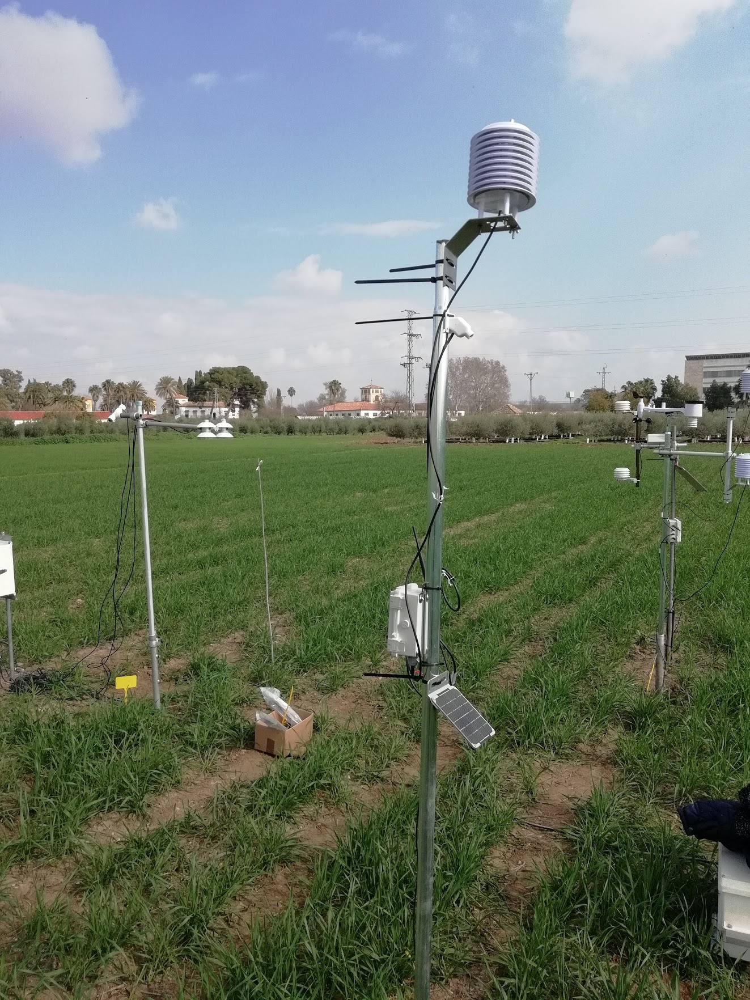

# CORDOVA-ET-Hardware
Hardware parts for the CORDOVA-ET system.

## What is CORDOVA-ET?
The COnductance Recording Device for Observation and Validation of EvapoTranspiration (CORDOVA-ET) is a set of different components and instruments designed to record micrometeorological variables required for the calculation of evapotranspiration (ET) using the energy balance (EB) method. It has been developed by the University of Cordoba ([UCO](https://www.uco.es/)) and the [IAS-CSIC](https://www.ias.csic.es/) as part of the [SIDA-FAO project](http://www.fao.org/3/ca8794en/CA8794EN.pdf).

For more information, you can join FAO's D-Groups on Water Productiviy and Agriculture, where you can view the webinars explaining the system and download manuals and troubleshooting guides. [D-groups access](https://dgroups.org/fao/waterproductivity/cordova_et)

## Hardware
The system consists on a group of LoRaWAN nodes that can measure simultaneously infrared temperature, air temperature and humidity as well as solar radiation.

This repository contains the design files to build a node yourself, including PCBs and 3D printed parts.

## Software
The code for the nodes can be found [here](https://github.com/OpenAgriTech/CORDOVA-ET-node)

## License
Licensed under Creative Commons Attribution-NonCommercial-ShareAlike 4.0 International (CC BY-NC-SA 4.0). See LICENSE.md for more info.

IAS-CSIC & University of Cordoba, 2021
